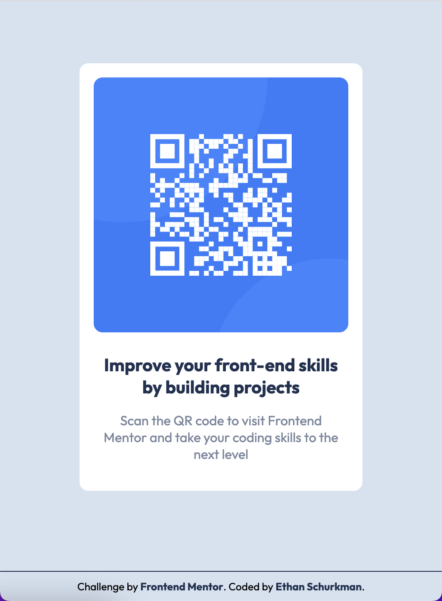

# Frontend Mentor - QR code component solution

This is a solution to the [QR code component challenge on Frontend Mentor](https://www.frontendmentor.io/challenges/qr-code-component-iux_sIO_H). Frontend Mentor challenges help you improve your coding skills by building realistic projects. 

## Table of contents

- [Overview](#overview)
  - [Screenshot](#screenshot)
  - [Links](#links)
- [My process](#my-process)
  - [Built with](#built-with)
  - [What I learned](#what-i-learned)
  - [Continued development](#continued-development)
- [Author](#author)

**Note: Delete this note and update the table of contents based on what sections you keep.**

## Overview

### Screenshot

### Links

- Solution URL: [GitHub](https://github.com/ethan-schurkman/qr-code-component-main)
- Live Site URL: [GitHub Pages](https://ethan-schurkman.github.io/qr-code-component-main/)

## My process

### Built with

- HTML
- CSS

### What I learned

I improved at structuring my HTML in a logical way to assist with my development work

### Continued development

I think that I developed this well. I want to continue getting comfortable "recreating" stuff with CSS.

## Author

- Website - [Ethan Schurkman](https://github.com/ethan-schurkman)
- Frontend Mentor - [@ethan-schurkman](https://www.frontendmentor.io/profile/ethan-schurkman)
